# GPT-4 Copilot X 震撼来袭！AI 写代码效率 10 倍提升，码农遭降维打击

##### **【导读】**GPT-4加强版Copilot来了！近日，GitHub发布了新一代代码生成工具GitHub Copilot X，动嘴写代码不再是梦。

微软真的杀疯了！

此前，微软刚用GPT-4升级了Office办公全家桶，还没等人们反应过来，微软又来抄码农的家了。

随后，GitHub官宣：基于GPT-4的新一代代码生成工具Copilot X来了！

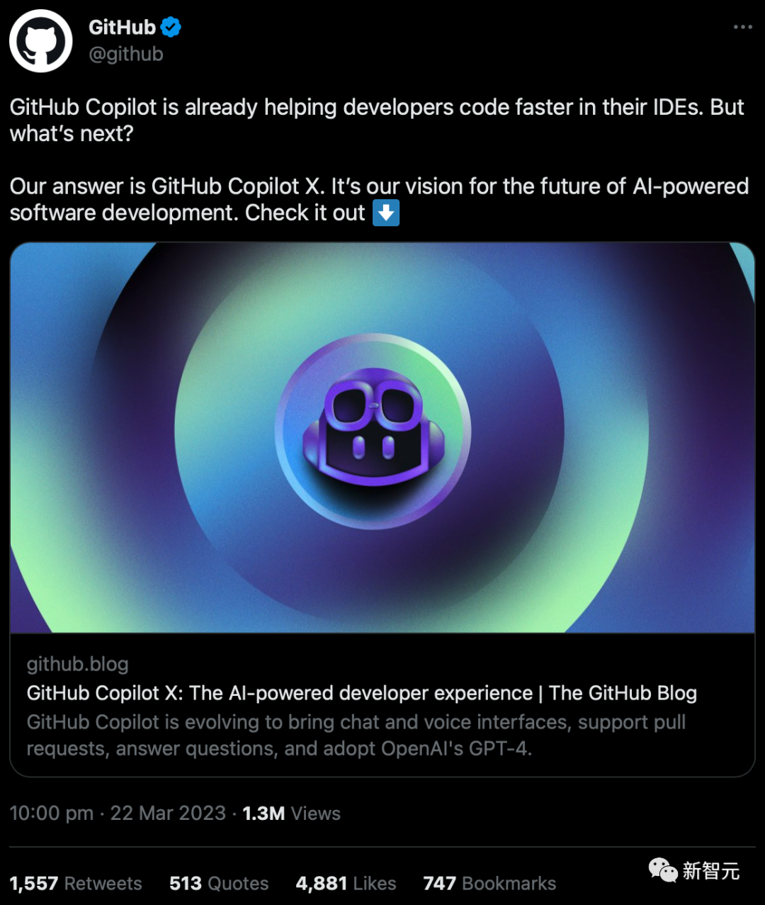

GitHub Copilot发布还不到两年，就已经为100多万的开发者编写了46%的代码，并提高了55%的编码速度。而这次的重磅升级，更是强到发指。

新一代Copilot X，直接整合里一个华丽的聊天界面，不仅动动嘴皮子就能生成代码，还能边写代码边跟AI对话，以及为你量身定做的智能文档系统等等。

GPT-4加持Copilot，动嘴就能写代码

## 

具体来说，Copilot X提供支持的体验有：Copilot Chat；Copilot for Pull Request；Copilot for Docs；Copilot for CLI。

这些新功能都是由OpenAI的GPT-4驱动的。值得注意的是，由于速度延迟的原因，代码自动补全工具仍基于GitHub的Codex模型上，该模型是在GPT-3上训练的。

现在，微软已经将GPT-4集成到搜索、办公、写代码等各种真正意义上的生产力工具上，属实是拥有了开启第四次科技革命的力量。

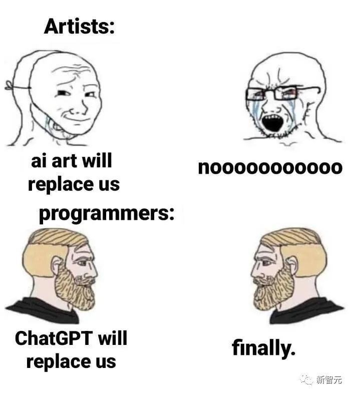

资深大数据架构师祝威廉称，Everything powered by AI已经不再遥远：

> 如果说，OpenAI GPT-4只是个模型完成了从0到1，微软则推动了其商业化直接前进一大步。
>
> 这次，Copilot X的发布，直接降维打击上一代Copilot。

目前，Copilot X已经开启排队入口。但比较麻烦的是，每项体验都得申请排队。

对此网友戏称：「每一天都在各种申请Waitinglist的路上。」

——刚加入了Bard的候补，又要开始排Copilot X的队。

' fill='%23FFFFFF'%3E%3Crect x='249' y='126' width='1' height='1'%3E%3C/rect%3E%3C/g%3E%3C/g%3E%3C/svg%3E)

### **Copilot Chat**

申请地址：https://github.com/github-copilot/chat_waitlist_signup/join

GitHub在Copilot中内嵌一个基于GPT-4的聊天窗口，专注于开发者场景，并集成成在VS Code和Visual Studio上。

然鹅，它不仅仅是一个聊天窗口那么简单。

' fill='%23FFFFFF'%3E%3Crect x='249' y='126' width='1' height='1'%3E%3C/rect%3E%3C/g%3E%3C/g%3E%3C/svg%3E)

现在，Copilot不仅可以识别开发者输入的代码内容，报错信息显示，还可以对代码块的用途进行深入分析和解释，生成单元测试。

甚至还可以给出debug的建议。

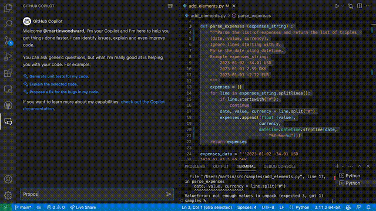

此外，在Copilot中，你甚至不再需要键盘来编写代码。

只需坐在电脑前，说一句「嘿，GitHub！」，动动嘴皮子编代码就能实现了。

目前，GitHub正在试验GitHub Copilot Voice新功能，一个基于语音的交互系统。

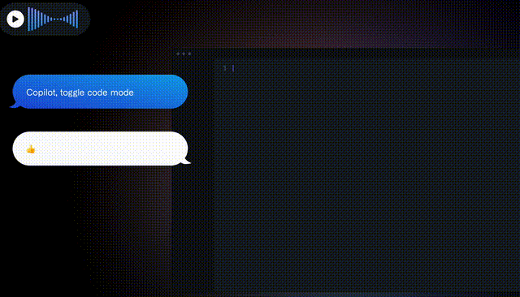

除了编写代码，通过Copilot Voice，你甚至可以完成：代码跳转、控制IDE、代码总结。

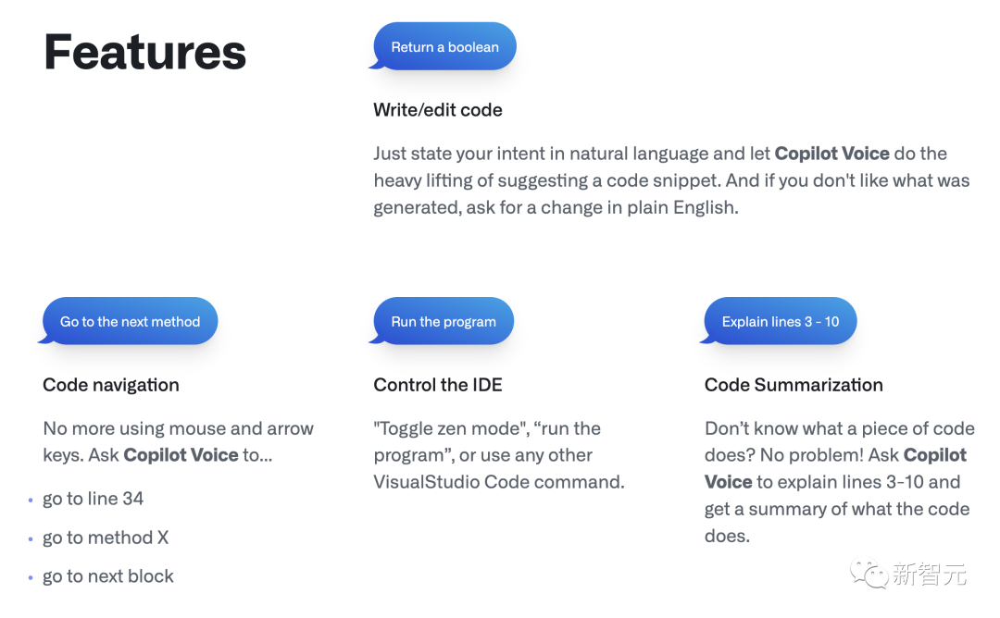

**Copilot for Pull Request**

### 

申请地址：https://copilot4prs.githubnext.com/login

除了编辑器外，全新的GitHub Copilot还会为Pull Requests提供加持。

开发者在PR描述中插入标签，Copilot便会自动识别，并进行扩展补写。

目前支持的标记，主要有以下几种：

- copilot:summary为PR生成一段摘要总结。
- copilot:walkthrough详细的更改列表，包括指向相关代码段的链接。
- copilot:poem写一首诗来描述本次改动。
- copilot:all自动生成以上所有内容。

' fill='%23FFFFFF'%3E%3Crect x='249' y='126' width='1' height='1'%3E%3C/rect%3E%3C/g%3E%3C/g%3E%3C/svg%3E)

而这，还只是第一步。

未来，Copilot还会新增Gentest和Ghost Text的两大功能。

Gentest：当Copilot发现提交的Pull Request缺少足够的测试时，会自动提醒开发者，并根据项目需求建议可编辑、接受或拒绝的潜在测试。

对于项目所有者来说，这个功能还可以帮助他们去制定关于测试的策略，同时支持开发者遵循这些策略。

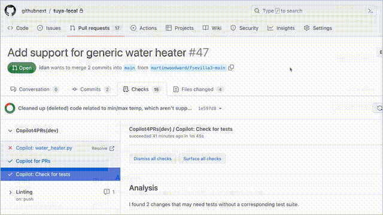

Ghost Text：当开发者创建Pull Request时，Copilot会动态地获取代码更改的相关信息，并自动给出建议。

此外，GitHub正在进行的其他探索和实验包括：

解决AI问题：可以自动描述如何解决问题，甚至自动建议需要进行的更改。

如下，在提交了转移到PyTorch的问题后，新功能可以提供生成代码建议，并发起新的Pull Request。

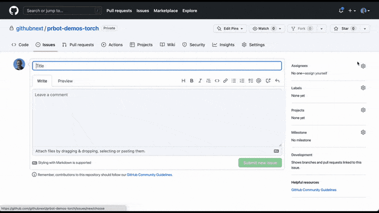

用AI审查PR：由于大量的开发人员将时间花费在代码审查，以及为代码审查准备PR上，这一功能就可以减少审查花费的周期。

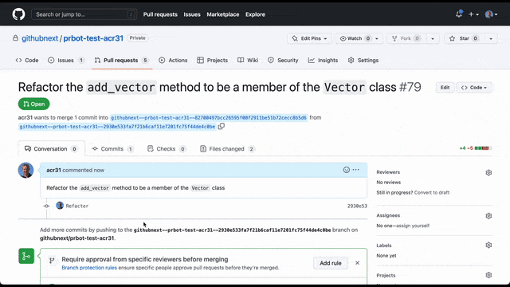

### **Copilot for Docs**

申请地址：https://githubnext.com/projects/copilot-for-docs

一份优秀的技术文档对于一位开发者的重要性，显然不言而喻。

Copilot for Docs这一功能能够帮你从这份文档中快速定位，并找到想要的内容。

官方博客称，Copilot for Docs仅是一个实验性的工具。程序员可以通过聊天界面来找到文档中的内容，包括使用的语言、框架和技术等问题。

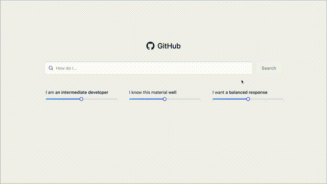

比较厉害的地方是，就是这个个性化的特点。

它可以根据用户的不同编程水平，对该文档的了解程度，以及想要查找的内容，输出不同的答案。

程序员还可以第一时间获取最新内容，直接从GitHub repo让现有的材料与最新版本的文档保持同步。

同时，从GitHub获取内容的另一个好处是，可以轻松回答有关团队私有内容的问题。这一功能可以在现有的GitHub权限基础上提供只有自己内部团队可以看到的信息。

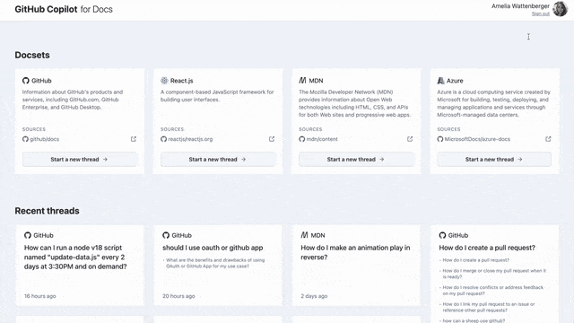

此外， Copilot还可以在不同第三方文档之间来回穿梭，比如React、 Azure文档和MDN，可以将其内容进行拼接，并返回结果。

未来，GitHub还要探索索引文档以外的资源的其他方法，比如问题、请求、讨论和wiki，以便为开发人员提供回答技术问题所需的一切。

### **Copilot for CLI**

申请地址：https://githubnext.com/projects/copilot-cli/

在代码编辑和pull request旁边，命令行终端是开发人员花费最多时间的地方。

但是，即使是最熟练的开发人员也需要滚动许多页面，来记住许多命令的精确语法。

而GitHub Copilot CLI可以编写命令和循环，并给出模糊的find标志来满足程序员的查询。

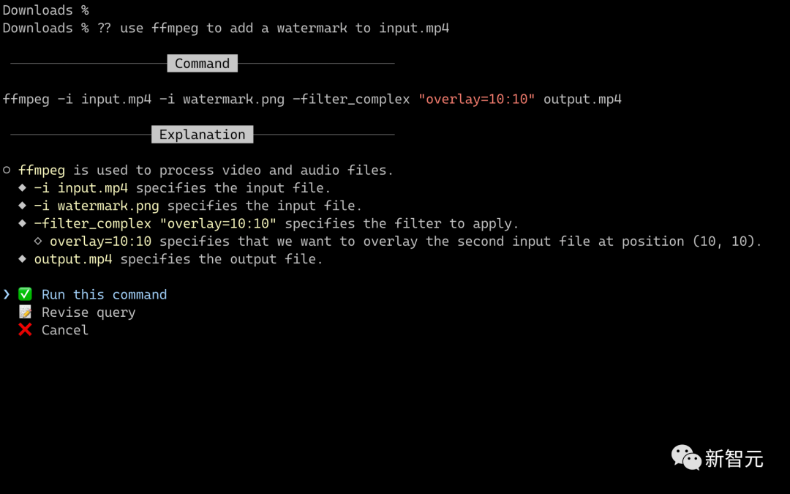

CLI的Copilot提供了三个shell命令: ??，git?，gh?。

「??」是指用于任意shell命令的通用goto。它将组成命令和循环，并抛出模糊的查找标志以满足个人查询。

「git?」用于专门搜索以及调用git。相比??，它将在生成Git命令方面更加强大，你甚至不需要解释处于Git的上下文时，查询更加简洁。

「gh?」将结合了GitHub CLI命令和查询界面的强大功能，并使用AI生成复杂标志和jq表达式。

软件开发黄金时代！10倍效率提升

## 

GitHub首席执行官Thomas Dohmke称，虽然自动补全代码已经大大提升开发人员的生产力，而全新的Copilot X能将开发人员的生产力提升10倍。

随着全新聊天功能的出现，Copilot将成为未来人们学习编码的基础。

「软件开发的黄金时代已经来到聊天界面。」

英伟达科学家Jim Fan表示，「10倍工程师依旧是个神话，但是100倍由AI加持的工程师比以往任何时候都要真实。」

鉴于GitHub「混搭」了OpenAI的GPT-3和GPT-4，来驱动聊天功能和现有的自动补全代码功能。

Dohmke解释道，当你在编辑器中输入时，肯定是希望得到非常快的响应。

因此，在需要速度的地方，我们使用较小的模型，如代码自动补全基于Codex；而在需要准确性的地方，我们使用较大的模型，如聊天中使用GPT-4。

网友：码农「已死」

## 

网友纷纷表示，编程已经被ChatGPT永远地改变了。

「作为一个开发者，这实在是令人沮丧。编程中，我们快乐的源泉是与逻辑打交道和解决技术问题，而不是专注于生产力或满足需求。」

「我已经做了30年的编程，但我仍然很喜欢它。我不知道没有人类代码的世界会是什么样子。不过我确实很喜欢有CoPilot来处理那些烦人的东西，还有ChatGPT来帮助我解决bug。」

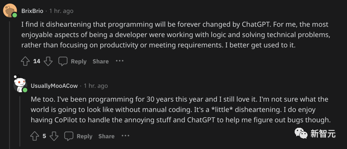

「AI出现后，可能就不再需要这么多码农了。对此我感到非常焦虑，即便已经在各种存钱和投资了，但还需要差不多9年时间才能『躺平』。我略微羡慕那些在FANG工作的人，他们似乎可以轻而易举地实现财务自由。」

「从中长期来看，我们将会失去工作。」

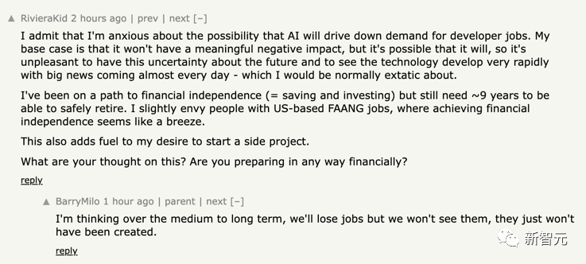

程序员们终于用编程把自己淘汰了……

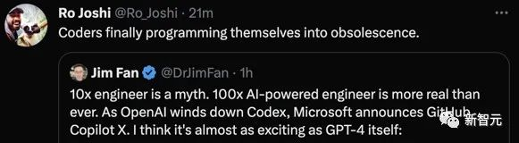

参考资料：

https://github.blog/2023-03-22-github-copilot-x-the-ai-powered-developer-experience/

\- EOF -