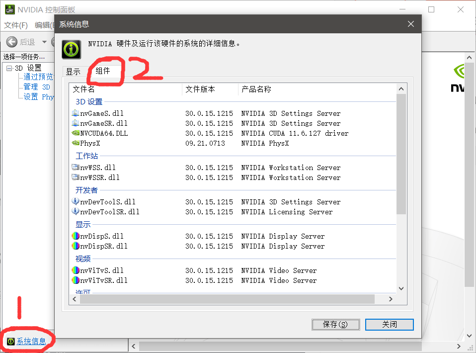
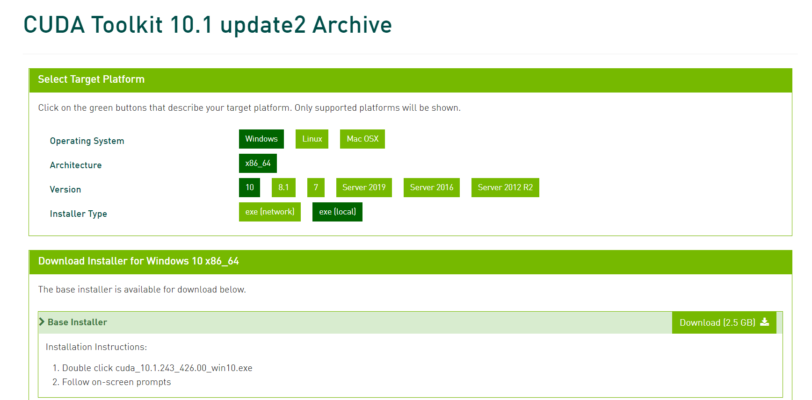
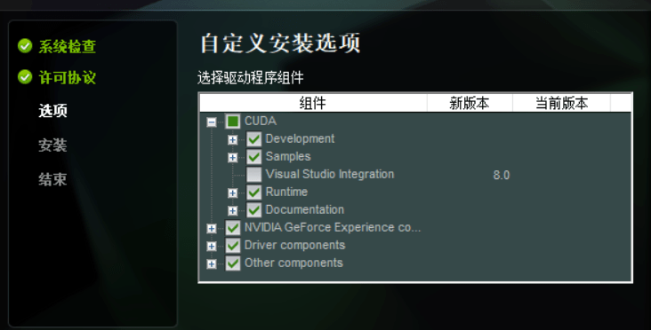
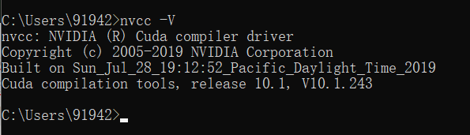
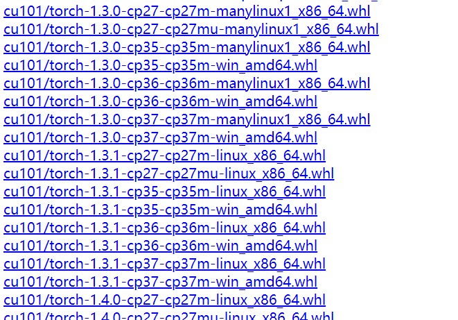
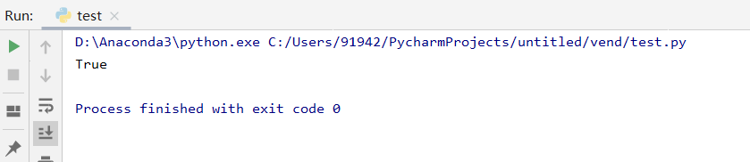
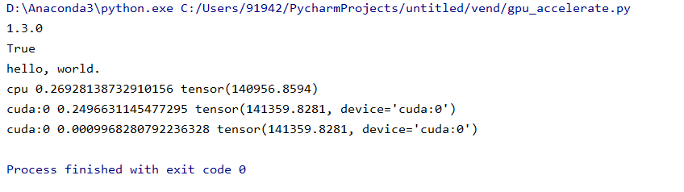

# Windows下显卡支持的cuda及配套GPU版本pytorch下载全流程（2022.03.27）

# 一、更新电脑显卡驱动（以mx150为例）

1、打开英伟达驱动下载官网：https://www.nvidia.cn/geforce/drivers/
2、直接下载自动更新程序，安装流程很简单。
3、打开下好的驱动更新软件，选择自动更新驱动，

4.打开NVIDIA控制面板——系统信息——组件——可以看到我mx150现在支持的是11.6.127版本CUDA。


# 二、官网下载相应版本CUDA

1、打开网址https://developer.nvidia.com/cuda-toolkit-archive
2、由于我之前没有更新驱动，我下载的是CUDA Toolkit 10.1 update2，选择local，可以用迅雷接管下载，速度比较快。
3、打开安装程序，可以选择默认路径安装在c盘，选择自定义安装，如果电脑没有安装VS 的话需要取消vs前的勾，还有把每个小加号点开，如果新版本的版本号比你当前版本的版本号还要低的选项也要取消，之后点击继续。

4.下面就可以验证cuda是否安装成功：
在运行里面输入“cmd” 然后用命令“nvcc -V”进行测试
即如下的代码，此处需要注意的是：中间是有空格的，之后按回车键。

```c
nvcc -V
```

运行结果如下，可以看到安装成功v10.1.243.

# 三、安装对应版本torch

1、如果已经下过torch可以先验证一下行不行
运行以下代码，如果返回true证明当前torch版本与cuda是对应的且可以调用。若返回false，则进行下一步。

```c
import torch
print(torch.cuda.is_available()) 
```

2.可以运行一下代码，如果返回值里面带有cpu则说明是cpu版本的torch，需要重新下载。

```c
import torch
print(torch.__version__)
```

3.下载torch及torchvision，我试过用pip命令下载，但是用的清华镜像源不太好使，于是我直接去官网找的包，再进行导入，进入包的链接：https://download.pytorch.org/whl/torch_stable.html
4、进入之后找到我们下载的cuda对应版本的torch和torchvision。
文件名对应的含义
cu101：支持cuda版本10.1
torch-1.3.0：torch的版本
cp37：python的版本3.7
win：操作系统
直接对应着文件的含义下载好需要的包。

5、导入下载好的包
直接在cmd运行pip install命令后添加whl包的全路径名就能本地安装成功了

```c
pip install D:\你下载的包存放路径\torch-1.3.0-cp37-cp37m-win_amd64.whl
```

我在执行命令的时候它自动给我卸载了之前的torch和torchvision，可以在cmd中运行`pip list`查看torch和torchvision是否都成功安装了下载的版本。

# 四、验证

1、再次运行命令，可以看到能返回true了。

```c
import torch
print(torch.cuda.is_available())
```


2.我们可以试着跑一段小程序看看效果

```c
import 	torch
import  time
print(torch.__version__)
print(torch.cuda.is_available())
print('hello, world.')


a = torch.randn(10000, 1000)
b = torch.randn(1000, 2000)

t0 = time.time()
c = torch.matmul(a, b)
t1 = time.time()
print(a.device, t1 - t0, c.norm(2))

device = torch.device('cuda')
a = a.to(device)
b = b.to(device)

t0 = time.time()
c = torch.matmul(a, b)
t2 = time.time()
print(a.device, t2 - t0, c.norm(2))

t0 = time.time()
c = torch.matmul(a, b)
t2 = time.time()
print(a.device, t2 - t0, c.norm(2))
```

可以看到在用cpu执行需要花费0.26秒，而GPU运行只需要0.0009秒（print两次是因为第一次在cuda执行时需要完成一些环境的初始化，这一次的描述是不准确的，再次运行就能比较准确的反应在cuda下的运行时间）


来源：Geoffrey0718

### 您可能感兴趣的内容:

- [Pytorch基础（二）- Tensor数据类型](https://www.iotword.com/4873.html)
- [Pytorch的使用](https://www.iotword.com/4747.html)
- [YOLOV5源码的详细解读](https://www.iotword.com/3480.html)
- [狂肝两万字带你用pytorch搞深度学习！！！](https://www.iotword.com/3292.html)
- [torch各种版本下载](https://www.iotword.com/2764.html)